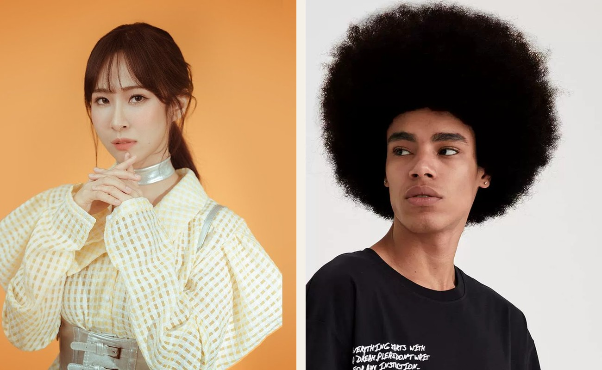
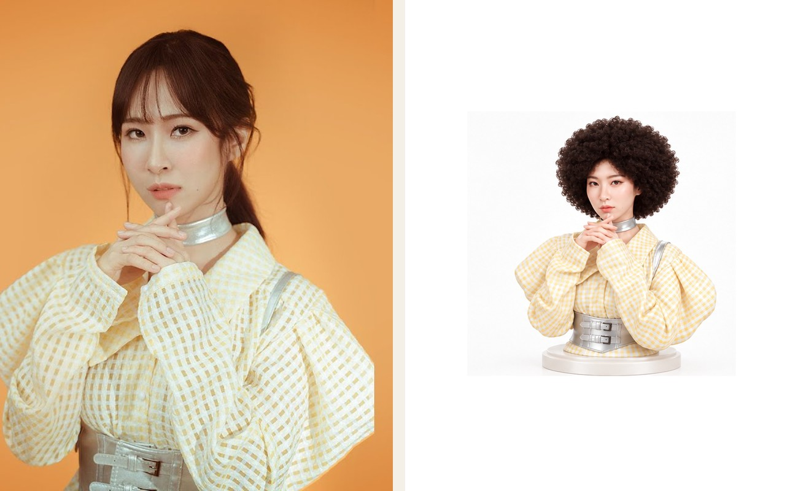
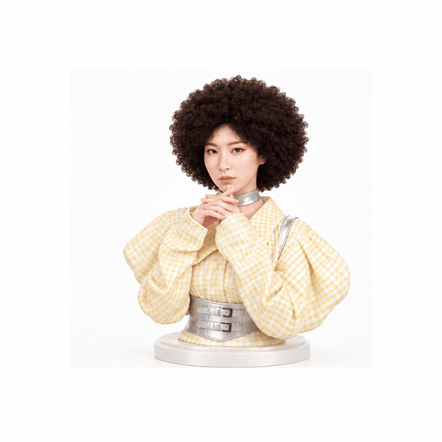
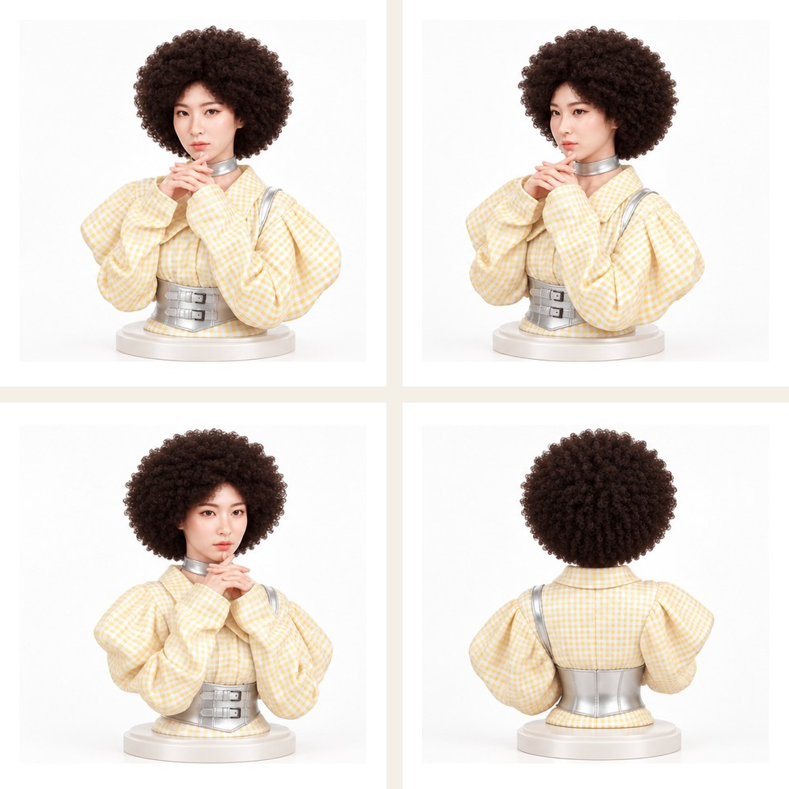

# ezHairSwap

**「我想剪這個。」先看自己的樣子，再預約。**

女生在 IG、小紅書、Pinterest 存下一張髮型參考圖，現在的流程通常是：存圖 → 找髮廊 → 傳給設計師 → 問適不適合 → 預約。

ezHairSwap 把這條路縮成：**自己的照片 + 想要的髮型 → 先試，再約。**

這不是即時上傳換髮的後端產品，而是一個**可展示的 demo 站**：用今天的真實素材，把試髮、多角度、3D 諮詢、預約閉環一次講清楚。

[](https://giorno-giovanna-dio.github.io/ezHairSwap/)
[](https://github.com/Giorno-Giovanna-Dio/ezHairSwap)

---

## 先看 Demo

👉 **[打開 Live Demo](https://giorno-giovanna-dio.github.io/ezHairSwap/)**

這支錄影是網站上的實際操作：**bombhair 換到女生頭上 → 四視角試看 → 展開 3D bust 旋轉**。

<p align="center">
  <video src="docs/demo/try-on-3d-demo.mp4" width="420" autoplay loop muted playsinline controls poster="docs/demo/try-on-3d-demo-poster.jpg">
    <source src="docs/demo/try-on-3d-demo.mp4" type="video/mp4">
  </video>
</p>

<p align="center"><sub>2D 試髮轉盤 · 可收合的 3D 人像檢視器</sub></p>

---

## 這次 demo 做了什麼

| 輸入 | 輸出 |
| --- | --- |
| 人像 `afu.jpg` | 2D 試髮 preview |
| 髮型 `bombhair.webp` | 正面 / 左 45° / 右 45° / 背面 |
| 換髮結果圖 | 可旋轉的 3D bust（`bust.glb`） |

同一張臉、同一件衣服，頭髮換成 bombhair 的捲度與量感。重點不是單張正面好看，而是**轉到側面與背面還是同一個人、同一頂頭髮**。

---

## Performance demo · 靜態對照

### 輸入：自己的照片 ＋ bombhair

<p align="center">
  
</p>

### 2D Preview · Before / After

<p align="center">
  
</p>

### 多角度 · 正面 / 左 45° / 右 45° / 背面

<p align="center">
  
</p>

<p align="center">
  
</p>

---

## 網站上的完整旅程

| 步驟 | 內容 |
| --- | --- |
| 1. 上傳 | 自己的照片 + 想要的髮型 |
| 2. 2D 試髮 | 可拖曳、自動旋轉的四視角 preview |
| 3. 我要這個 | 系統判斷 Curly / Volume / Layer 等標籤 |
| 4. 推薦設計師 | NT$3,200–4,500 · 約 3 小時 · 剪燙套餐 |
| 5. 3D（可收合） | 頁尾展開，給設計師看後面與層次 |

**KPI 應該是 Try-on → Booking Conversion Rate，不是 3D model generation success rate。**

---

## 兩個會賺錢的場景

### 場景一 · 預約前

客人在社群已經決定「我想剪這個」。你要做的是讓她在**自己臉上**看到結果，再把單接到對的設計師。

| 過去 | 現在 |
| --- | --- |
| 存圖 → 找店 → 傳給設計師 → 問適不適合 → 預約 | 上傳照片 + 髮型 → 2D Preview → 多角度 →「我要這個」→ 設計師 · 價格 · 預約 |

### 場景二 · 店內諮詢

客人坐下來說：「老師，我想要像這張照片。」

| 過去 | 現在 |
| --- | --- |
| 「臉型不一樣」「長度不夠」「效果沒辦法完全一樣」— 只能靠講 | iPad：客人照片 + Reference → 約 10 秒 → 客人自己的 Try-on |

3D 是**諮詢工具**，不是取代設計師。燙染與高單價剪染燙套餐，比 NT$600 剪髮更有價值。

---

## 本機跑起來

```bash
npm start
```

瀏覽器打開 [http://localhost:4173](http://localhost:4173)。

純靜態站，GitHub Pages 從 repo 根目錄發布即可上線。

---

## 技術備註

- **前端**：HTML / CSS / Vanilla JS
- **3D**：Three.js + Draco 壓縮 GLB
- **素材**：人像 + bombhair 參考 → 四視角換髮圖 → Meshy 3D bust
- **原始 Meshy GLB** 約 134 MB，不進 repo；網站用壓縮版 `bust.glb`（8.2 MB）

## 檔案結構

```
original-img/              人像與 bombhair 參考
swap-img-result/           四視角換髮結果（含 crop/）
3d-model/bust.glb          網站用壓縮 3D 人像
3d-model/video-demo/       原始螢幕錄影
docs/demo/                 README 用圖片、GIF、demo 影片
index.html                   展示站首頁
js/                          試髮轉盤 + 3D viewer
```

---

## License

Demo project. 素材僅供展示用途。
